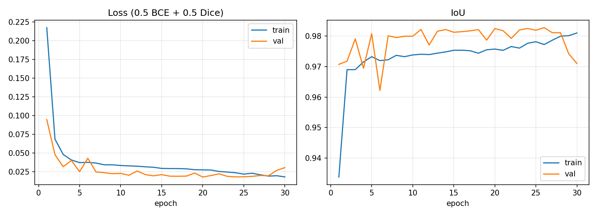
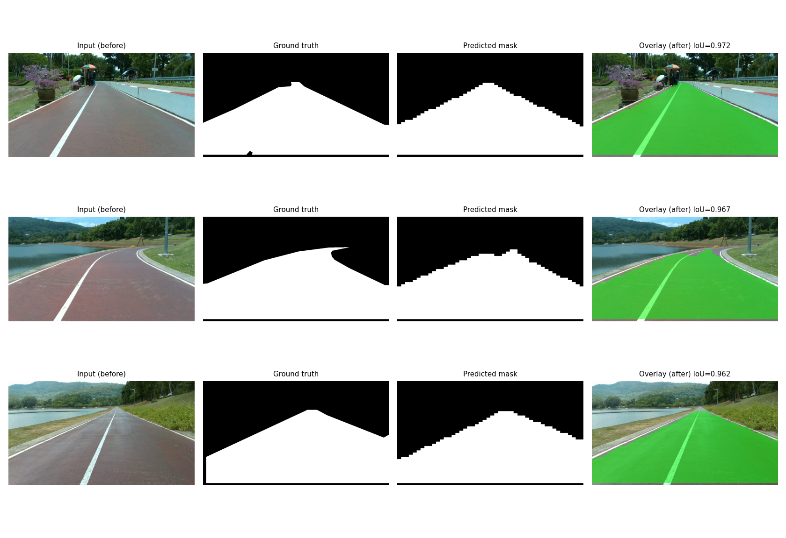

# Custom Lane U-Net (48×48) — trained from scratch

Single-class lane segmentation on the PSU-reservoir dataset (YOLO-seg polygons, class 0 `lane` only; other classes/bboxes ignored). Course: AI Ecosystem, Assignment-10.

## 1. Network design
Full diagram: [custom-unet-architecture.md](custom-unet-architecture.md). 3-level U-Net, input `3×48×48`, output `1×48×48`, **482,737 params**, no pretrained weights (Kaiming default init, BatchNorm).

Rationale:
- **3 levels (48→24→12→6):** 48 halves cleanly three times, so skip connections align without padding. A 4th level would shrink the map to 3×3, which is too small for such a small image.
- **Channels 16→128:** small enough for a laptop (~1.8 MB of weights) but enough capacity for a single class.
- **Skip connections:** recover the lane boundary positions lost by pooling.
- **BatchNorm:** gives stable training from scratch with batch size 4.
- **Loss = 0.5·BCE + 0.5·Dice:** BCE gives stable gradients, Dice directly optimises overlap.

## 2. Data & training
- Images of any size are accepted. Polygons are rasterised at the image's own resolution and then resized to 48×48 (nearest for masks, area for images).
- Split: 700 train / 200 val / 100 test (1280×720 frames).
- Augmentation (train only, slight): per-channel white-balance gain ±8%, brightness shift ±0.08, 3×3 Gaussian blur.
- 30 epochs, Adam lr 1e-3, batch size 4, Apple MPS. The best checkpoint is chosen by val loss (epoch 20).
- TensorBoard: `tensorboard --logdir runs`



The loss falls quickly in the first epochs and then plateaus. Val loss reaches about 0.018 at its best (epoch 20); val IoU is about 0.97–0.98. Val loss fluctuates a little near the end (0.027–0.031 in epochs 29–30), so the best checkpoint is used rather than the last.

## 3. Evaluation (100 test images)
`evaluation.py` upsamples the predicted mask to the original image size and computes pixel-wise IoU against the rasterised ground-truth polygons. A frame counts as detected if IoU > 0.6.

| Metric | Value |
|---|---|
| Detected (IoU > 0.6) | **99 / 100 (99%)** |
| Mean IoU of detected frames | **0.937** |
| Mean IoU, all frames | 0.934 |

The one miss is `frame_0960` (IoU 0.597, just under the threshold). Full per-image results are in [evaluation_results.json](evaluation_results.json).

## 4. Before / after
Columns: input, ground truth, predicted mask, overlay.



Predicted masks are 48×48, so the upsampled boundary looks blocky. Saved masks are in `run/`.

## 5. Inference memory footprint
Measured on CPU (MacBook Air), 1 image 48×48 ([memory_footprint.json](memory_footprint.json)):

| Item | Value |
|---|---|
| Parameters | 482,737 |
| Weights (fp32) | 1.84 MB (file 1.87 MB) |
| Conv activations, batch 1 | ~1.03 MB |
| Latency | ~1.1 ms / image |
| Peak process RSS (incl. Python, PyTorch, matplotlib, TensorBoard reader) | ~371 MB |

The model itself needs only a few MB. Most of the RSS is the PyTorch runtime.

## 6. Usage
```bash
pip install -r requirements.txt
python train.py --data-dir /path/to/dataset      # expects images/{train,val,test}, labels/{train,val,test}
python inference.py --img-dir /path/to/dataset/images/test   # masks -> run/
python evaluation.py --img-dir /path/to/dataset/images/test  # IoU metrics
python report_assets.py                          # loss curve, snapshot, memory
```
