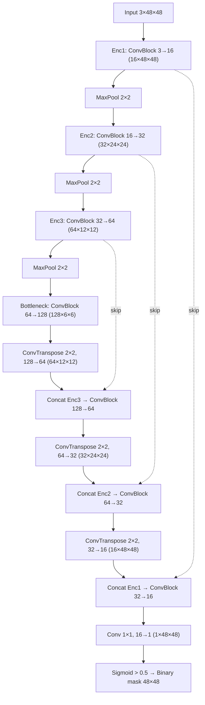

# Custom Lane U-Net Architecture

Input `3×48×48` RGB → output `1×48×48` logits (sigmoid > 0.5 → binary lane mask). 482,737 parameters, trained from scratch.

`ConvBlock` = `[Conv3×3 (no bias) → BatchNorm → ReLU] × 2`.
